---
presentation:
  width: 1600
  height: 900
  slideNumber: 'c/t'
  showSlideNumber: "all"
  center: true
  enableSpeakerNotes: true
---

<!-- slide -->
# CRYPTOGRAPHY 密码学
### CRYPT-6 数字签名

<!-- slide -->
## 目录
6.1 数字签名概念
6.2 RSA数字签名体制 
6.3 ElGamal数字签名体制  
6.4 其它数字签名方案
6.5 数字签名标准
6.6 应用

<!-- slide -->
## 6.1 数字签名概念
- 在政治、军事、外交、商业和日常生活中，人们经常需要对纸质材料进行签名。
- 签名起到确认、核准、生效和负责任等多种作用。
- 随着计算机网络技术的发展，电子商务、电子政务和电子金融等系统得到广泛应用，人们需要通过网络信息传输对电子的文件、契约、合同、信件和张单等进行数字签名以替代手写签名。

<!-- slide -->
## 6.1 数字签名概念
- 签名是证明当事人的身份和数据真实性的一种信息。
- 在传统的以书面文件为基础的事物处理中，采用书面签名的形式，如手签、手印和印章等。书面签名得到司法部门的支持，具有一定的法律意义

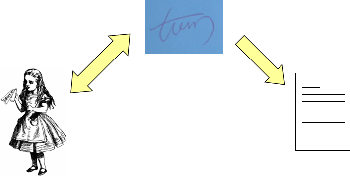

<!-- slide -->
## 6.1 数字签名概念
- 在以计算机文件为基础的现代事物处理中，应采用电子形式的签名，即数字签名（digital signature）。
- 数字签名的目的是提供一种手段，使得一个实体把他的身份与某个信息捆绑在一起。
- 一个信息的数字签名实际上是一个数，它仅仅依赖于签名者的密钥和被签名的消息。 

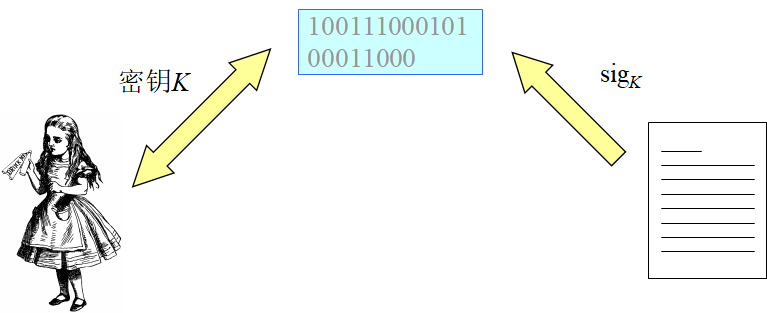

<!-- slide -->
## 6.1.1 数字签名的基本概念

 一个数字签名体制是一个满足以下条件的五元组: $(M,S,K,sig,ver)$

- 消息空间M：由所有任意长度消息组成的集合
- 签名空间S: 由所有签名组成的集合。签名长度不超过n。
- 密钥空间K
- 签名算法sig：$M\times K→S$， $s=sig_k(m)$
- 验证算法ver：$M\times S→\{ture,false\}$，
$$
ver(m,s)=
\begin{cases}
Ture,s=sig_k(m)\\
False,s\neq sig_k(m)
\end{cases}
$$
- 任意消息$m\in M$，如果$s=sig_k(m)$，则将数据对（x，y）称为消息x的一个数字签名，或直接把y称为消息x的数字签名

<!-- slide -->
## 6.1.1 数字签名的基本概念

- 数字签名基本要求
    - 对每一个密钥K, sigK和verK应该是多项式时间函数
    - verK是公开的函数, 而sigK是保密的 
    - 给定一个消息x, 除了发送者本人以外, 任何其他人找到满足verK(x,y)为真的数字签名y,应该是计算上不可行的
    - 如果攻击者能够找到满足verK(x,y)的数据对(x,y),而发送者事先又没有对x签名,则称y是伪造(forgery)的数字签名。 
- 数字签名算法必须满足的条件
    - 签名者事后不能否认自己的签名；
    - 其他人不能伪造签名；
    - 当通信双方为签名真伪发生争执时, 可以由第三方解决争端

<!-- slide -->
## 6.1.1 数字签名的基本概念
### 手写签名与数字签名的区别
- 手写签名是所签文件的物理组成部分，数字签名必须与所签文件捆绑在一起。
- 手写签名通过与标准签名进行比较或检查笔迹来验证，数字签名是通过验证算法来验证。手写签名容易伪造，好的数字签名算法应该使伪造签名十分困难。
- 手写签名不易复制。数字签名是一个二进制串，容易复制。所以必须防止数字签名重复使用。

<!-- slide -->
## 6.1.1 数字签名的基本概念
### 签名算法进行分类
- 按应用目的
    - 普通数字签名
    - 特殊目的数字签名: 不可否认数字签名、盲签名、群签名等
- 按验证方法
    - 在验证时需要输入被签名信息
    - 在验证时自动恢复被签名信息
- 按签名时是否使用随机数
    - 分成确定性数字签名
    - 随机数字签名

<!-- slide -->
## 6.1.2 数字签名的基本构造方法
利用Hash函数和加密算法可以构造有效的数字签名方案。
1. 基于Hash函数和对称密码算法构造数字签名方案

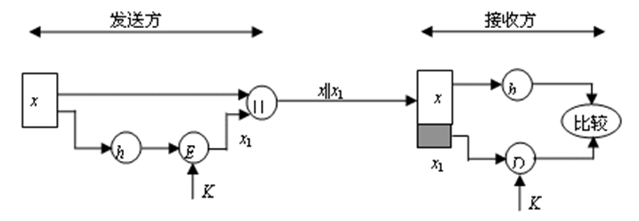

<!-- slide -->
## 6.1.2 数字签名的基本构造方法
2. 基于Hash函数和公钥密码算法构造数字签名

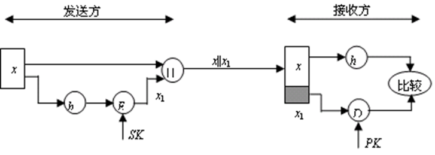
<!-- slide -->
## 6.1.2 数字签名的基本构造方法
具有保密作用的数字签名
公钥密码体制：$S_K$是发送方的私钥，$P_K$是发送方的公钥， $E_1$和$D_1$分别是加密算法与解密算法。
对称密码体制密钥：K是双方公用密钥，$E_2$和$D_2$分别是对应的加密算法和解密算法。 

<!-- slide -->
## 6.1.3 数字签名的安全需求
### 数字签名的攻击模型
- 唯密钥攻击（key-only attack）
    攻击者E拥有签名者A的公钥K，因而能够计算验证函数verK。
- 已知消息攻击（known message attack）
    攻击者E拥有一系列以前由签名者A所签名的消息。即E具有数据对（xi，yi），其中xi是消息，yi=sigK (xi)是A对xi的签名（i=1, 2, …）。
- 选择消息攻击（chosen message attack）
    攻击者E可以选择一些消息请求签名者A签名。即
    E选择消息$x_i$，并将$x_i$发送给签名者A，请求A对$x_i$签名。A计算$y_i=sig_K(x_i)$，并将$y_i$发给E。所以，E具有A的有效数字签名（$x_i,y_i$）（$i=1, 2, …$）。

<!-- slide -->
## 6.1.3 数字签名的安全需求
### 攻击者对数字签名系统的攻击目的
- 完全破译（total break）
    攻击者E能确定签名者A的私钥K，因而能够计算签名函数$sig_K$，可以对任何消息产生有效的签名。
- 选择性伪造（selective forgery）
     攻击者E能以某一个不可忽略的概率对另外某个人选定的消息产生一个有效的签名。也就是说，如果给E选定一个消息x，那么他能以一个正的概率找到x的签名$y=sig_K(x)$，并且签名者A以前未对x签名。
- 存在性伪造（existential forgery）
    攻击者E至少能够为一个消息产生一个有效的签名。也就是说，E可能生成一个数据对（x，y），其中x是消息，$y=sig_K(x)$。签名者A以前未对$x$签名。

<!-- slide -->
## 6.1.3 数字签名的安全需求
### Hash函数与数字签名的安全性
- 对消息的散列值签名

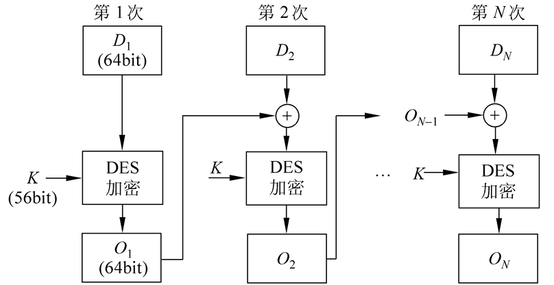

<!-- slide -->
## 6.1.3 数字签名的安全需求
- 使用已知消息攻击的存在性伪造
    攻击者E从一个有效的签名(x, y)开始,其中$y=sig_k(h(x))$.然后他计算$z=h(x)$,并企图找到$x'\neq x$,使得$h(x')=h(x)$.如果E能做到这一点,则(x’, y)就是一个有效的签名, 从而y是消息x'的一个伪造签名.为了阻止这种攻击, 必须要求Hash函数h是弱无碰撞的.
- 使用选择消息攻击的存在性伪造
    攻击者E首先找到$x'\neq x$, 使得$h(x')=h(x)$. 然后将消息x发给签名者A, 并让A对消息的散列值h(x)签名, 从而得到$y=sig_k(h(x))$. 所以E能够成功伪造签名$(x', y)$. 为了阻止这种攻击,必须要求Hash函数h是强无碰撞的.

<!-- slide -->
## 6.1.3 数字签名的安全需求
使用唯密钥攻击的存在性伪造
   当签名算法遭到唯密钥攻击时, 即攻击者E拥有签名者A的公钥K.E就可能对一个随机的散列值z伪造签名$y=sig_k(z)$. 此时, 如果Hash函数h不是单向的,则E可能找到一个消息x，使得$z=h(x)$.所以E能够成功伪造一个签名(x, y).为了阻止这种攻击, 必须要求Hash函数h是单向的.

<!-- slide -->
## 6.2 RSA数字签名体制
利用RSA加密算法构造的数字签名称为RAS数字签名体制。

<!-- slide -->
## 6.2.1 RSA数字签名算法描述
1. 密钥生成算法
    - 选取两个大素数p，q，计算
    $n=p\times q,\varphi(n)=(p-1)\times (q-1)$
    - 任选整数e，满足：
    $0< e <\varphi(n)$，且$gcd(e ,\varphi(n))=1$
    - 用扩展Euclidean算法求e模(n)的逆d，即
    $e\times d=1\space mod\space \varphi(n)$
    - 签名者的公钥: {$n,e$}，私钥:{ $p,q,d$}。 

<!-- slide -->
## 6.2.1 RSA数字签名算法描述
2. 签名算法
    设消息为x，则x的RAS签名是
    $y=x^d\space mod\space n$
3. 验证算法
    当接收方收到签名（x，y）后，计算
    $x'=y^e\space mod\space n$
    如果$x= x'$，则y是x的RAS签名

<!-- slide -->
## 6.2.2 RSA数字签名的安全性
1. 一般攻击
    - 攻击方法:  设n与e为用户A的公钥，攻击者首先随意选择一个数据y，并用A的公钥计算
    $x=y^e\space mod\space n$
    于是可以伪造A的一个RSA数字签名（x，y）。因为
    $x^d=(y^e)^d=y^{ed}=y\space mod \space n$
    所以用户A对x的RSA数字签名是y。
    - 这种攻击实际上成功的概率是不高的
    因为对于选择的数据y，得到的x=ye mod n具有正确语义的概率是很低的。
    - 抵抗措施
        - 仔细设计数据格式
        - 对数据的Hash值进行签名
<!-- slide -->
## 6.2.2 RSA数字签名的安全性
2. 选择消息攻击
- 攻击方法：假设攻击者E想伪造消息x的签名，他容易找到两个数据$x_1$和$x_2$，使得
$x=x_1\times x_2 \space mod \space n$
攻击者E设法让用户A分别对x1和x2 进行签名，得到 
$y_1=x_1^d\space mod\space n$，$y_2=x_2^d\space mod \space n$
然后E可以计算
$y=y_1\times y_2=x_1^d\times x_2^d=(x_1\times x_2)^d=x^d\space mod \space n$
于是攻击者E得到了用户A对消息x的RSA数字签名y
- 抵抗措施
    - 用户不要轻易地对其他人提供的随机数据进行签名
    - 对数据的Hash值进行签名

<!-- slide -->
## 6.2.2 RSA数字签名的安全性
3. 利用签名进行攻击从而获得明文
- 攻击方法
    假设攻击者E已截获了秘文$c=x^e \space mod\space n$，他想求出明文x。于是，他选择一个小的随机数r，并计算
        $s=r^e\space mod\space n$
        $l=s\times c\space mod\space n$
        $t=r^{-1}\space mod\space n$
因为s=re,所以sd=( re)d= mod n，r=sd mod n.然后E 设法让签名者对l签名. 于是E又获得k=ld mod n. 攻击者E再计算：
$t\times k=r^{-1}\times l^d=r^{-1}\times s^d\times c^d=r^{-1}\times r\times c^d=x \space mod \space n$

于是，获得了密文x。

- 抵抗措施
    - 用户不要轻易地对其他人提供的随机数据进行签名
    - 对数据的Hash值进行签名 

<!-- slide -->
## 6.2.2 RSA数字签名的安全性
4. 对先加密后签名方案的攻击
- 攻击方法
假设签名者A采用先加密后签名的方案把消息x发送给接收者B ,则他先用B的公开密钥$e_B$对x加密, 然后用自己的私钥dA签名.设A的模数为nA,B的模数为nB.于是A发送给B的数据为:
$(x^{e_B}\space mod\space n_B)^{d_A}\space mod \space n_A$
如果B是不诚实的,那么B可能伪造A的签名.例如,假设B想抵赖收到A发的消息x, 慌称收到的是x1.因为nB是B的模数,所以B知道nB的分解,于是能够计算模nB的离散对数.即他能找到k满足: 
$(x_1)^k=x\space mod \space n_B$
然后，B再公布他的新公开密钥为keB。现在B宣布他收到的消息是$x_1$，而不是$x$。

<!-- slide -->
## 6.2.2 RSA数字签名的安全性
由于下式成立，所以A无法争辩。
$(x_1^{ke_B}\space mod\space n_B)^{d_A}\space mod\space n_A=(x^{e_B}\space mod\space n_B)^{d_A}\space mod\space n_A$

- 抵抗措施
    - 签名者A应当在发送的数据中加入时间戳，从而可证明是用公开密钥eB对x加密，而不是用新公开密钥keB对x1加密。
    - 对数据的Hash值进行签名。 

<!-- slide -->
## 6.2.2 RSA数字签名的安全性
- 综上所述，对于RSA数字签名系统，必须采取如下安全措施：
    - 不直接对消息进行签名，而应该对消息的Hash值进行签名。
    - 要采用先签名后加密的方式，而不要采用先加密后签名的方式。

<!-- slide -->
## 6.3 ElGamal数字签名体制
- 在1985年，ElGamal T. 提出了一个基于离散对数问题的数字签名体制，通常称为ElGamal数字签名体制。
- ElGamal签名体制的安全性主要是基于有限域上离散对数问题的难解性。

<!-- slide -->
## 6.3.1 ElGamal签名算法描述
1. 参数生成算法
    - 选取一个大素数$p,g\in Z_p^*$是一个本原元，p和g是系统公开参数。
    - 任选整数x，满足：1≤x≤p-2。计算
    $y=g^x\space mod\space p$
    签名者的公钥为y，私钥为x。
2. 签名算法
    设$M\in Z_p^{*}$为待签名的消息。签名者随机选择一个秘密整数k，1≤k≤p-2，计算
    $r=g^k\space mod\space p$
    $s=(M-x\times r)k^{-1}\space mod\space(p-1)$
    签名者对M的ElGamal签名为:
    $sig(M)=(r,s)\in Z_P^{*}\times Z_{p-1}^{*}$
    签名者将数据(M,(r,s))发送给接收者

<!-- slide -->
## 6.3.1 ElGamal签名算法描述
3. 验证算法
接收方收到签名(M, (r,s)) 后，验证
$y^r\times r^s=g^M\space mod\space p$
是否成立，如果等号成立，则确认(r, s)是M的有效签名。
    - 有效性证明
    因为：$s=(M-x\times r)k^{-1}\space mod\space (p-1)$
    所以：$k\times s+x\times r=M\space mod\space (p-1)$
    因此，如果（r，s）是M的正确签名，则一定有
    $y^r\times r^s=g^{xr}\times g^{ks}=g^{xr+ks}=g^M\space mod\space p$

<!-- slide -->
## 6.3.1 ElGamal签名算法描述
ElGamal数字签名是一个随机的数字签名体制 
例如：设p=11，g=2是$Z_{11}^*$的本原元。选取私钥为x=8，
计算公钥
$y=g^x\space mod \space p=2^8\space mod\space 11=3$
设签名者A要对消息M=5进行签名。签名者A首先秘密选取一个整数k=9，计算
$r=g^k\space mod\space p=2^9\space mod \space 11=6$
$s=(M-x\times r)k^{-1}\space mod(p-1)=(5-8\times 6)\times 9^{-1}\space mod\space 10=3$
签名者A对$M=5$的ElGamal签名为（6, 3）。
接收者B可以对消息M=5的签名（6, 3）进行验证。
因为：$3^6\times 6^3=2^5\space mod\space 11$

<!-- slide -->
## 6.3.2 ElGamal数字签名的安全性 
### ElGamal数字签名算法的实现
- 需要作一次模指数运算
- 一次扩展Euclidean算法运算（求随机数k的逆元）
- 二次模乘运算
- 前两个运算可以离线进行
- 是一个随机的数字签名体制

<!-- slide -->
## 6.3.2 ElGamal数字签名的安全性
### ElGamal数字签名体制的参数p
- $p$的选择与在Zp*中计算离散对数的算法有直接关系。从目前的计算水平来看，p至少应该是二进制512位的素数，从长期安全性考虑，应使用1024位或更长的素数。
- $p-1$最好有大的素因子
- 私钥$x$最好是$Z_p^*$的素数阶子群的生成元。

<!-- slide -->
## 6.3.2 ElGamal数字签名的安全性
### 不知道私钥的攻击
假设攻击者E不知道私钥$x$，要想伪造消息M的签名(r,s), 则E可能使用的攻击方式有：
- 攻击者已知消息M,选择一个值r,再求另一个值s.此时,因为有：
    $y^r\times r^s=g^M\space mod\space p$
    $s=log_r^{g^M\times y^{-r}}\space mod\space p$
    所以攻击者E必须计算离散对数。
- 攻击者已知消息M,选择一个值s,再求另一个值r. 此时, 他必须从同余方程
    $y^r\times r^s=g^M\space mod\space p$
    中求出r。这是一个到目前为止还没有可行方法求解的方程，甚至也看不出它与离散对数问题有没有关系。

<!-- slide -->
## 6.3.2 ElGamal数字签名的安全性
### 不知道私钥的攻击
- 攻击者已知消息M，同时求(r,s). 即他必须从同余方程
$y^r\times r^s=g^M \space mod\space p$
中同时求出(r,s)。现在人们对这个方程的认识几乎是一无所有，既没有人发现解这个问题的方法，也没有人能够证明不能解这个问题。
- 攻击者选择数据对(r,s)，求消息M。此时必须计算离散对数
$M=log_g^{y^r\times r^s}\space mod\space p$

<!-- slide -->
## 6.3.2 ElGamal数字签名的安全性
### 不知道私钥的攻击
- 攻击者同时选择数据M，r和s，使得(r, s)是M的签名。这种攻击方法可能获得成功。攻击者首先选择整数i和j，$0\leq i,j\leq p-2,gcd(j,p-1)=1$，计算

    $r=g^i\times y^j\space mod\space p $
    $s=-r\times j^{-1}\space mod\space (p-1)$
    $M=-r\times i\times j^{-1}\space mod \space(p-1)$

    由于：
    $
    \begin{aligned}
    y^r\times r^s=y^r\times(g^i\times y^j)^{-rj^{-1}}=y^r\times g^{-irj^{-1}}\times y^{-r} \\
                                                =g^{-irj^{-1}}=g^{M}\space mod\space p
    \end{aligned}
    $
    成立，所以(r, s) 是消息M的有效签名 
    该攻击方法属于存在性伪造。因此，在使用ElGamal数字签名方案时，不要直接对消息进行签名，而应该对消息的Hash值进行签名。

<!-- slide -->
## 6.3.2 ElGamal数字签名的安全性
### 不知道私钥的攻击
- 例6.3
设p=467，g=2是$Z_{467}^*$的本原元，签名者公钥y=132。攻击者选择整数i=99，j=1.79，计算
$j^{-1}=179^{-1}\space mod \space 466=151$
$r=2^{99}\times 132^{179}\space mod\space 467=117$
$s=-117\times 151\space mod \space 466=41$
$M=-117\times 99\times 151\space mod\space 466=331$
<!-- slide -->
## 6.3.2 ElGamal数字签名的安全性
由于：
$y^r\times r^s=132^{117}\times 117^{41}=303\space mod\space 467$
$g^{M}=2^{331}=303\space mod\space 467$
所以（117,41）是消息M=331的有效签名
<!-- slide -->
## 6.3.2 ElGamal数字签名的安全性
### 已知消息攻击
假设攻击者E知道(r, s)是消息M的签名,则E可利用它来伪造其它消息的签名. 选择整数$l,i,j,0\leq l,i,j\leq p-2,gcd(lr-js,p-1)=1$，计算
$u=r^l\times g^i\times y^j\space mod\space p$
$v=s\times u\times (l\times r-j\times s)^{-1}\space mod\space (p-1)$
$W=u\times (l\times M+i\times s)\times (l\times r-j\times s)^{-1}\space mod\space (p-1)$
<!-- slide -->
## 6.3.2 ElGamal数字签名的安全性
由于$y^r\times r^s=g^M\space mod\space p $，所以

$
\begin{aligned}
r^s&=y^{-r}\times g^M\space mod\space p \\
    &=y^u\times (r^l\times g^i\times y^j)^{su(lr-js)^{-1}} \\
    &=y^{u+jsu(lr-js)^{-1}}\times r^{hsu(lr-js)^{-1}\times g^{isu(lr-js)^{-1}}} \\
    &=y^{u+jsu(lr-js)^{-1}-rlu(lr-js)^{-1}}\times g^{isu(lr-js)^{-1}+Mu(lr-js)^{-1}} \\
    &=y^{u(l-(lr-js)(lr-js)^{-1})}\times g^{(is+lM)u(lr-js)^{-1}} \\
    &=g^w\space mod \space p
\end{aligned}
$

可见$(u, v)$是消息$W$的有效签名。   
- 该攻击方法属于存在性伪造
- 使用对消息的Hash值进行签名的方式,可以抵抗这类攻击。

<!-- slide -->
## 6.3.2 ElGamal数字签名的安全性
### 使用ElGamal数字签名方案的安全措施    
- 不要泄露随机数k
    否则，根据：
    $s=(M-x\times r)k^{-1}\space mod \space (p-1)$
    可计算出私钥：
    $x=(M-s\times k)\times r^{-1}\space mod \space (p-1)$
- 不要使用同一个随机数k给两个不同的消息签名设（r，s）是消息M的签名，（u，v）是消息W的签名，使用的是同一个随机数k，则可求出私钥。  

<!-- slide -->
## 6.3.3 ElGamal签名体制的变形
### ElGamal数字签名算法有多种变形
- 设大素数p是模数，g是一个模p的本原元，x为签名者的私钥，k为随机数，m为待签名的消息，（r，s）是对M的签名。签名值的分量$r=g^k\space mod \space p$, 分量s由签名算法确定。ElGamal数字签名各种变形的签名算法和验证算法见下表。

<!-- slide -->
## 6.3.3 ElGamal签名体制的变形

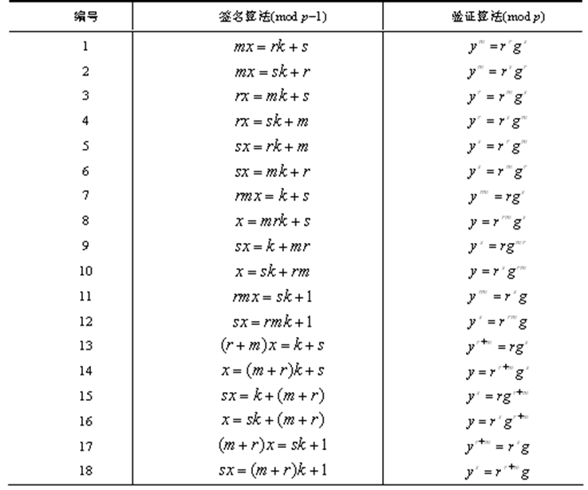

<!-- slide -->
## 6.4 其它数字签名方案
- Fiat-Shamir数字签名
- 一次性数字签名
- 不可否认数字签名
- 盲签名 
<!-- slide -->
## 6.4.1 Fiat-Shamir数字签名
- Fiat-Shamir数字签名由A. Fiat和 A. Shamir提出，有时简记为FS数字签名。与RSA数字签名相比较，FS数字签名的主要优势是速度快，它仅需要RSA的1%~4%的模乘法。FS数字签名的理论基础是大整数素因子分解的困难性。
- 参数生成:  选取两个大素数p、q，令$n=p\times q$。n是公开参数，p和q是管理中心CA掌握的密钥。设h是一个公开的Hash函数，k是一个固定的正整数。
    - 管理中心CA为用户A产生k个公开密钥：$y_i (i =1,2,…,k)$  是模n的平方剩余
    - 再为用户A产生k个私钥（保密）：
    $x_1=\sqrt{\smash[b]{y_1^{-1}}}\space mod\space n$，$x_2=\sqrt{\smash[b]{y_2^{-1}}}\space mod\space n$，$...$，$x_k=\sqrt{\smash[b]{y_k^{-1}}}\space mod\space n$

<!-- slide -->
## 6.4.1 Fiat-Shamir数字签名
### 签名算法：
为了对消息m进行签名,用户A执行以下步骤：
1. 随机选取一个正整数t。
2. 在1和n之间随机选取t个正整数rj (j =1,2,…,t)，并计算
$R_j=r_j^2\space mod\space n\space (j=1,2,...,t)$
3. 计算Hash函数值h (m|| R1|| R2||…|| Rt)，依次取出其前$k\times t$个比特值，记为
$b_{ij}(i=1,2,...,k;j=1,2,...,t)$
4. 计算：$s_j=r_j\prod_{i=1}^{k} x_{i}^{b_{ij}}\space mod\space n\space (j=1,2,...,t) $
    用户A对消息m的数字签名为：
    $\{b_{ij}\},\{s_j\}(i=1,2,...,k;j=1,2,...,t)$
    签名者将数据$(m,\{b_{ij}\},\{s_j\})$发送给接收者B

<!-- slide -->
## 6.4.1 Fiat-Shamir数字签名
### 验证算法：
接收方B收到签名数据$(m,\{b_{ij}\},\{s_j\})$后, 按以下步骤进行验证：
1. 利用A的公钥计算：$R_j^{'}=s_j^2\prod^{k}_{i=1}y_i^{b_{ij}}\space mod\space n\space (j=1,2,...,t)$
2. 计算Hash函数值：$h(m||R_1^{'}||R_2^{'}||...||R_t^{'})$，依次取出其前$k\times t$个比特值，记为：$b_{ij}^{'}(i=1,2,...,k;j=1,2,...,t)$
3. 比较等式：$b_{ij}=b_{ij}^{'}(i=1,2,...,k;j=1,2,,...,t)$
    是否成立。如果$k\times t$个等式全部成立，则数字签名有效。否则，数字签名无效。

<!-- slide -->
## 6.4.1 Fiat-Shamir数字签名
### 该验证算法的正确性
当数据传输正确时，有

得到：$h(m||R_1^||R_2||...||R_k)=h(m||R_1^{'}||R_2^{'}||...||R_k^{'})$
并且：$b_{ij}=b_{ij}^{'}(i=1,2,...,k;j=1,2,,...,t)$
<!-- slide -->
## 6.4.1 Fiat-Shamir数字签名
- 例6.4
设n=35，k=4，用户A的4个公钥为：$y_1 =4$，$y_2 =11$，$y_3 =16$，$y_4 =29$。则A的4个私钥为：

取$t=1$,$r_1=16$，计算：$R_1=r_1^{2}=16^2=11\space mod\space 35$
为了简化，设$h(m||R_1)=R_1=11=1011$。即有：
$b_{11}=1,b_{21}=0,b_{31}=1,b_{41}=1$
$s_1=r_1\prod_{i=1}^{4}x_i^{b_{ij}}\space mod\space n=16\times 3^1\times 9^0\times 9^1\times 8^1=26\space mod\space 35$
数字签名为（{1,0,1,1}, {26}）
<!-- slide -->
## 6.4.1 Fiat-Shamir数字签名
- 例6.4
设n=35，k=4，用户A的4个公钥为：$y_1 =4$，$y_2 =11$，$y_3 =16$，$y_4 =29$。数字签名为（{1,0,1,1}, {26}）。
接收方验证方法如下。由于：$R_1^{'}=s_1^2\prod_{i=1}^{4}y_i^{b_{ij}}=26^2\times 4^1\times 11^0\times 16^1\times 29^1\space mod\space 35=11=R_1\space mod\space 35$
所以数字签名有效。

<!-- slide -->
## 6.4.2 一次性数字签名
- 一次性签名方案是指一对公、私钥只能用于对一个消息进行签名的方案，它通常被用于芯片卡（chipcards)。
- 1978年，M.O. Rabin首次提出一次性签名方案。在Rabin一次性签名方案中，签名算法使用了对称加密算法，验证过程需要验证者与签名者共同参与。
- 1979年，L. Lamport提出一个类似的方案，不同之处在于验证时不需要验证者与签名者交互。该方案由于受到著名密码学家Diffie和Hellman的重视而有名。
- 1992年，Bos与Chaum对Lamport的另一个更有效的一次性签名方案做了本质的改进，并证明了改进的签名方案在选择消息攻击下是不可伪造的。

<!-- slide -->
## 6.4.3 Lamport一次性数字签名
### 密钥生成：已知单向函数$f:Y→Z$
- 在Y中随机选取
$y_{1,0},y_{1,1},y_{2,0},y_{2,1},...,y_{k,0},y_{k,1}$为私钥。
- 计算：$z_{i,j}=f(y_{i,j})\space (1\leq i\leq k,j=0,1)$
单向函数$f$及$z_{1,0},z_{1,1},z_{2,0},z_{2,1},...,z_{k,0},z_{k,1}$为公钥

<!-- slide -->
## 6.4.3 Lamport一次性数字签名
### 签名算法
设消息$x=(x_k x_{k-1}...x_2 x_1)$是二进制串，则对消息x的签名为：{$u_i=y_{i,j}|1\leq i\leq k,x_i=j$} 
### 验证算法
若${f(u_i)|1\leq i\leq k}$包含在公钥中，则签名是合法的。

<!-- slide -->
## 6.4.4 Bos-Chaum 一次性数字签名
Bos-Chaum一次性签名方案的签名比Lamport方案的签名短。设A={1，2，…，2n}是2n元集合，B是A的所有n元子集构成的集合，则有$|B|=C_{2n}^n$。定义Bos-Chaum签名方案使用的单射函数为：$\varphi:\{0,1\}^k→B$
它把长为k的字符串映射到A的n元子集，这里$2^k\leq C_{2n}^n$
<!-- slide -->
## 6.4.4 Bos-Chaum 一次性数字签名
1. 密钥生成 
    设 f:Y→Z是单向函数，取$y1,y2,...,y2n\in Y$作为私钥，$z_1,z_2,...,z_2n\in Z$作为公钥，其中$f(y_i)=z_i(1\leq i\leq 2n)$。
2. 签名算法
    设消息$x=(x_kx_{k-1}...x_2x_1)_2$是二进制串，则对消息x的签名为：
    {$a_1,a_2,...,a_n$}$=$$\{y_j|j\in \varphi (x)\}$。
3. 验证算法 
    计算集合$C={f(a_i),1\leq i\leq n}$和$\varphi (x)$。如果$C=\{z_j|j\in \varphi (x)\}$，则{$a_1,a_2,...,a_n$}是对$x$的合法签名。

<!-- slide -->
## 6.4.4 Bos-Chaum 一次性数字签名
由于f是单向函数，对手不可能伪造消息的Bos-Chaum签名。
如果使用Bos-Chaum方案签了两个消息，则对手容易伪造Bos-Chaum签名。
例如，令n=4，容易计算出$\varphi (110010)=\{2,4,6,8\},\varphi (010011)=\{2,3,4,7\}$。已知对110010的Bos-Chaum签名为$\{y_2,y_4,y_6,y_8\}$，对010011的Bos-Chaum签名为$\{y_2,y_3,y_4,y_7\}$，容易得到对111100的Bos-Chaum签名为$\{y_2,y_4,y_7,y_8\}$。所以该签名方案是一次性签名方案。

<!-- slide -->
## 6.4.5 不可否认数字签名
对于以前讨论的数字签名，任何人都可以对签名进行验证。但在某些特殊应用条件下，需要在签名者参加的情况下才能进行验证。具有这种性质的数字签名称为不可否认签名方案(undeniable signature scheme)。它们可以应用在如下场合：
- 实体A 希望访问实体B控制的“安全区域”。实体B在授予实体A访问权之前，要求A对“访问时间、日期”进行签名。另一方面，实体A不希望别人了解这个事实，即没有实体A的参与，实体B不能通过出示实体A的签名及验证，来证明“实体A访问该区域”这一事实。
- 某公司A开发的一个软件包。A将软件包和他对软件包的不可否认签名卖给用户B。B当场验证A的签名，以便确认软件包的真实性。用户B想把该软件包的拷贝私自卖给第三者。由于没有公司A参与，第三者不能验证软件包的真实性。从而保护了公司A的利益 

<!-- slide -->
## 6.4.5 不可否认数字签名
Chaum和van Antwerpen在1989年提出的不可否认数字签名方案
### 密钥生成
随机选择素数$q,p=2q+1$。在$Z_p^{*}$中取q阶元$a(\neq1)$。从Euler准则知$a$是模$p$的二次剩余组成的。
选择秘密指数$1\leq x\leq p-1$，计算$y=a ^x\space mod \space p$。
公布公钥$(p,a,y)$，秘密保存私钥$x$。
### 签名算法
对消息m的签名是: $s=m^x\space mod\space p$。
<!-- slide -->
## 6.4.5 不可否认数字签名
### 验证协议
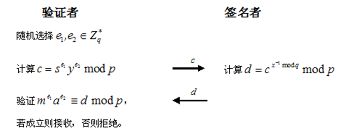

<!-- slide -->
## 6.4.5 不可否认数字签名
假设签名者A想否认一个“由签名生成算法构造出来的”合法签名，其方式有：
1. 拒绝参与验证协议；
2. 错误地执行验证协议；
3. 即使验证协议成功，也断言签名是伪造的。

对于前者很明显，而后两种情况难以防范。使用“否认协议”（disavowal protocol）能够确定是签名者A试图否认一个由签名算法得出的签名，还是签名本身是伪造的。否认协议由两遍验证协议组成。
<!-- slide -->
## 6.4.5 不可否认数字签名
### 否认协议 
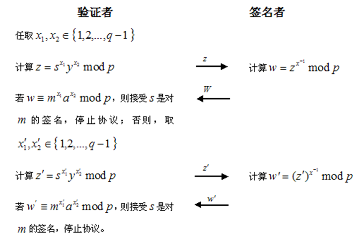

否则计算：$C=(wa^{-x_2})^{x_1'}\space mod\space p,C'=(w'a^{-x'_2})^{x_1}\space mod\space p$

进行一致性检验，若$C=C'$，则s是对m的伪造签名；若$C\neq C'$，则s是对m的合法签名，签名者试图否认。

<!-- slide -->
## 6.4.5 不可否认数字签名
### 否认协议的性质 
- 性质1：如果验证者和签名者都正确执行协议，则必有$C=C'$，说明s是对m的伪造签名，即
$s\neq m^x\space mod\space p$
- 性质2：如果$\widetilde{s}\neq m^x\space mod\space p$，则验证者把$\widetilde{s}$看作对m的合法签名的概率为$1/q$。
- 性质3：如果s是对m的合法签名，由于签名者采取不合作的态度，致使$w\equiv m^{x'_1}a^{x'_2}mod p$和$w\equiv m^{x_1}a^{x_2}\space mod\space p$
否认协议中最后$C\neq C'$的概率为$1-(\frac{1}{q})$。

<!-- slide -->
## 6.4.6 盲签名
- 对于前面介绍的数字签名，签名者知道所签名的消息。但在数字现金、电子投票等应用领域，要求签名者不能知道所签名的消息。
- 签名者对所签署消息和对消息的签名都不可见的数字签名称为盲签名（blind signature） 
- 盲签名由D. Chaum在1982年首次提出 

<!-- slide -->
## 6.4.6 盲签名
### 盲签名过程

- A是消息m的拥有者, 称为求签名者
- B称为签名者 
- 盲签名需要两个基本构件：
    - 求签名者A知道的盲化函数f 及脱盲函数g。f与g必须满足：
    $g(S_B(f(m)))=S_B(m)$
    - 签名者B的数字签名方案SB。
<!-- slide -->
## 6.4.6 盲签名
- 考虑盲签名在电子货币中的应用，例如顾客A得到银行B对钱款m的盲签名后，自己算出银行的真正签名SB(m)。在支付时提交出m和SB(m)，银行能验证SB(m)是否为m的合法签名，但不知道这是谁的一笔消费。从而使A保持匿名状态，即消费行为不受到监控。 

<!-- slide -->
## 6.4.7 基于RSA公钥密码系统的Chaum盲签名
Chaum提出的盲签名方案是基于RSA公钥密码系统的 
### 密钥生成
- 选取素数p、q，令$nB=p\times q,1<b_B<\varphi (n_B)$且$gcd(b_B,n_B)=1$，随机选取$1<a_B<\varphi (n_B)$使得$a_B\times b_B\equiv 1\space mod\space \varphi(n_B)$。
    签名者B的公钥是（$n_B,b_B$），私钥是$a_B$。

<!-- slide -->
## 6.4.7 基于RSA公钥密码系统的Chaum盲签名
### 盲签名协议
设需签名的消息为m
- A对m进行盲变换：随机选择盲因子$k$，$1<k<m$，计算$\widetilde{m}=m\times k^{b_s}\space mod\space n_B$
将$\widetilde{m}$发送给B
- B对$\widetilde{m}$进行盲签名：计算$\widetilde{s}=\widetilde{m}^{a_s}\space mod\space n_{B}$
将$\widetilde{s}$发送给A
- A对$\widetilde{s}$进行脱盲变换得到对m的签名：计算$s=\widetilde{s}\times k^{-1}=m^{a_s}\space mod\space n_B$
s即是B对m的签名
### 盲签名验证算法
验证$m=s^{b_s}\space mod\space n_B$。若成立，则接受s是对m的签名，否则拒绝
<!-- slide -->
## 6.4.8 基于离散对数问题的盲签名 
- 瑞士学者J. Lcamenisch, J. M. Pivetean提出了基于离散对数问题的盲签名  
### 密钥生成
签名者选择两个大素数p，q，q|(p-1)，在$Z_p^*$上离散对数问题是难解问题。a是$Z_p^{*}$的q阶元。选取私钥$x$，令$y=a^x\space mod\space p,(p,q,a,y)$为公钥。 
<!-- slide -->
## 6.4.8 基于离散对数问题的盲签名
### 盲签名协议
设A需签名的消息为m，盲签名由签名者B开始
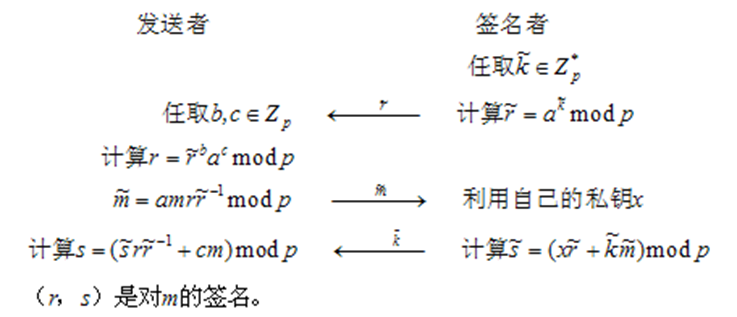
### 盲签名验证算法
验证$a^s\equiv y^rr^m\space mod \space p$，若成立，则接受(r,s)是对m的签名；否则拒绝。
<!-- slide -->
## 6.5 数字签名标准
数字签名标准（DSS: Digital Signature Standard）由美国国家标准技术研究所（NIST）于1991年提出，并于1994年正式成为美国联邦信息处理标准（FIPS PUB186），这标志着数字签名已得到政府的支持。DSS使用的签名算法称为数字签名算法（DSA: Digital Signature Algorithm）。2000年1月美国政府将RSA和椭圆曲线密码引入数字签名标准DSS，进一步丰富了DSS的算法。目前，DSS的应用已十分广泛，并被多个国际标准化组织采纳作为标准。美国的一些州已经通过相关法律，正式承认数字签名的法律意义。这是数字签名得到法律支持的重要标志。 

<!-- slide -->
## 6.5.1 美国数字签名标准
### 算法参数
DSA使用的参数如下

- p，q，g是公开参数，可为一组用户公用
- x和y分别为一个签名者的私钥和公钥，私钥x用于产生签名，必须保密  
- 所有这些参数可在一定时间内固定

<!-- slide -->
## 6.5.1 美国数字签名标准
### 签名算法
设SHA是一个安全hash函数

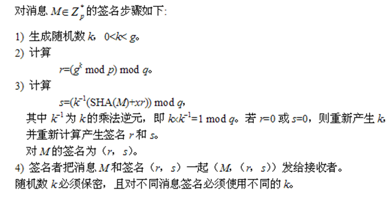

<!-- slide -->
## 6.5.1 美国数字签名标准
### 验证算法

<!-- slide -->
## 6.6 应用
手写签名可以用来签合同，那么数字签名可以用来干什么呢？

<!-- slide -->
## 6.6.1 网站认证
最常见的用处就是用来认证一个网站的身份。 
比如我打开百度，百度是怎么保证显示在我眼前的网页就一定是百度生成的，不是其他人修改的呢？就是借助数字签名来实现的。

用IE浏览器打开百度，点击地址栏旁边的小锁，再点击查看证书，就可以看到百度主页的数字签名证书了。所谓证书，其实是对公钥的封装，在公钥的基础上添加了诸如颁发者之类的信息。

 

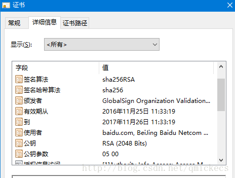

<!-- slide -->
## 6.6.2 代码签名
如果Windows上的可执行程序程序来源于正规公司，那么通常它会有代码签名，用于确保其来源可靠且未被篡改。以QQ为例，它的数字签名是这样的。 
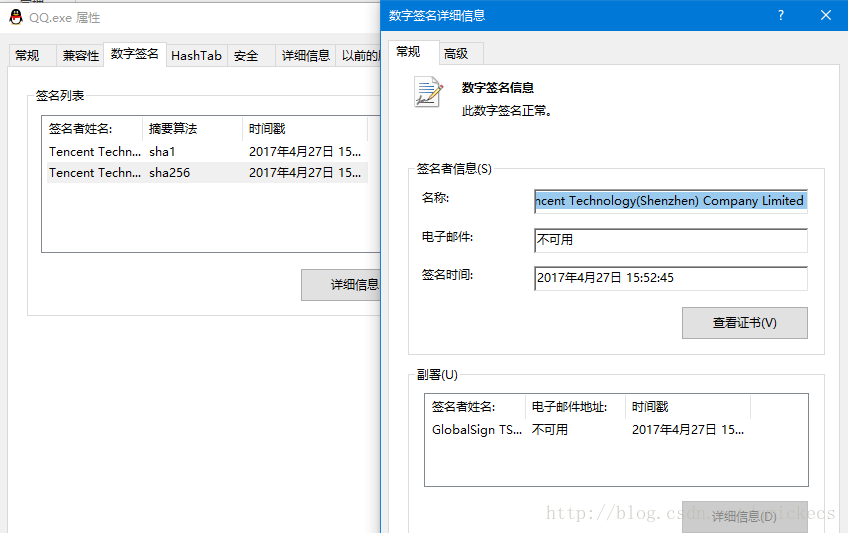

如果某个程序没有数字签名，那么它的安全性往往就没有保证，如果它有数字签名，但是显示“此数字前面无效”，那么这个程序要么被篡改了要么损坏了，不管哪种可能都不应该尝试执行它。
<!-- slide -->
## 6.6.3 比特币
比特币是一种完全匿名的数字货币，它的身份认证是基于ECDSA。比特币的账户地址就是对公钥计算摘要得到的，向全世界公布。而确认你是账户拥有者的唯一办法就是看你有没有账户对应的私钥。对于比特币中的任意一个交易记录，只有当其中付款方的签名是有效的，它才是有效的。如果账户私钥丢失，那么你将永远地失去里面的钱；一旦被黑客盗取，里面的钱就完全归黑客所有。
<!-- slide -->
## 6.6.4 电子邮件
- 对于电子邮件的安全性，主要有两个要求：其一是确保只有收信人才能阅读信件内容；其二收信人能够判断信件确由发信人发送，而未被别人伪造、或篡改。
- 目前应用最多的安全电子邮件系统是PGP（pretty good privacy）。PGP是一种基于Internet的保密电子邮件软件系统，能提供邮件加密、数字签名、认证、数据压缩和密钥管理功能，它是由美国Phi Zimmermann开发的。由于PGP系统功能强大，使用方便，所以在Windows、Unix和Mashintosh平台上得到广泛应用。
- PGP采用ZIP压缩算法对邮件数据进行压缩，采用IDEA对压缩后的数据进行加密，采用MD5对邮件数据进行散列处理，采用RSA对邮件数据的散列值进行数字签名，采用支持公钥证书的密钥管理，采用先签名后加密的数字签名方案 

<!-- slide -->
## 6.6.4 电子邮件
- PGP巧妙地将公钥密码RSA和单钥密码IDEA结合在一起，兼顾了安全性和效率。支持公钥证书的密钥管理使PGP系统更安全方便。PGP具有很好的灵活性，可支持IDEA、3DES等单钥密码体制，MD5、SHA等Hash函数，DiffeHellman等密钥协议。这些显著的技术特色使得PGP成为Internet环境最著名的保密电子邮件软件系统。
- PGP采用1024位的RSA、128位的IDEA密钥、128位的MD5、DiffeHellman密钥协议、公钥证书，因此PGP是安全的。如果采用160位的SHA，将进一步提高PGP的安全性。 

<!-- slide class="middle"-->

# Thanks for Watching
