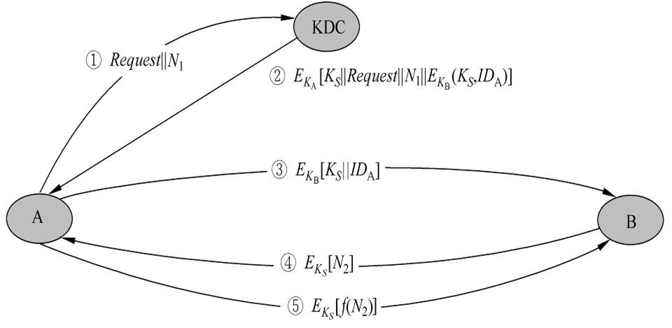
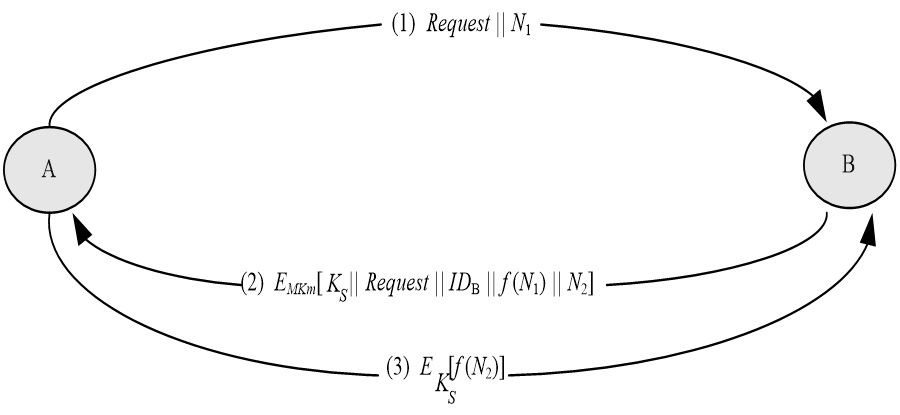
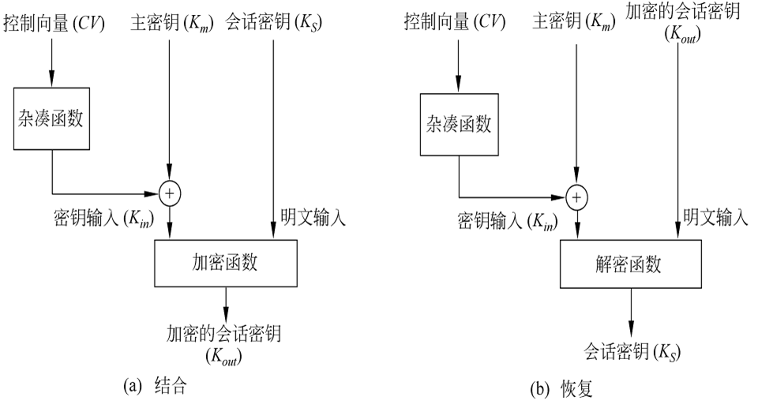
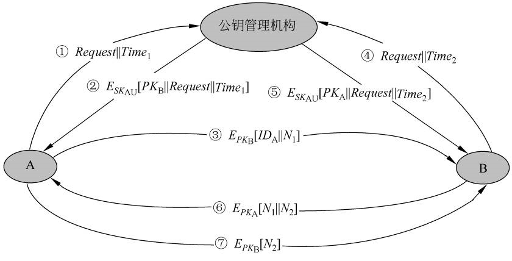
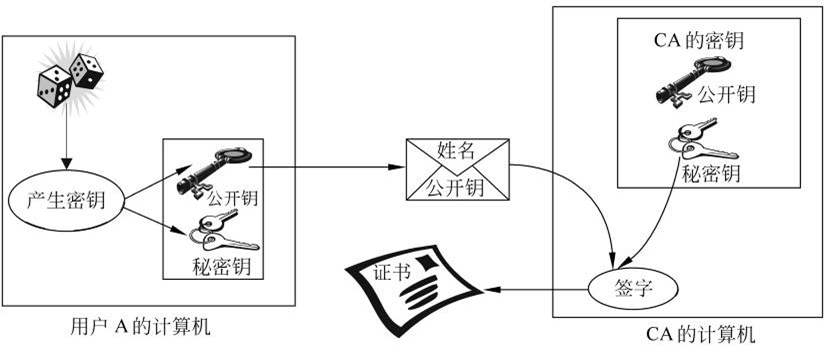
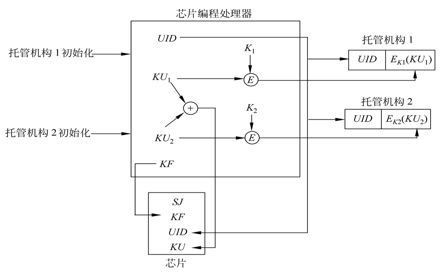
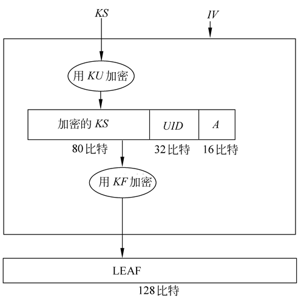
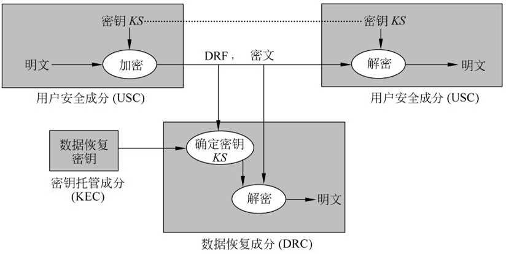

---
presentation:
  width: 1600
  height: 900
  slideNumber: 'c/t'
  showSlideNumber: "all"
  center: true
  enableSpeakerNotes: true
---

<!-- slide -->
# CRYPTOGRAPHY 密码学
### CRYPT-8 密钥分配与管理

<!-- slide -->
## 目录
8.1 单钥加密体制的密钥分配
8.2 公钥加密体制的密钥管理
8.3 密钥托管
8.4 秘密分割

<!-- slide -->
## 8.1 单钥加密体制的密钥分配
两个用户（主机、进程、应用程序）在用单钥密码体制进行保密通信时，首先必须有一个共享的秘密密钥，而且为防止攻击者得到密钥，还必须时常更新密钥。因此，密码系统的强度也依赖于密钥分配技术。
<!-- slide -->
## 8.1.1 密钥分配的基本方法
两个用户A和B获得共享密钥的方法有以下几种：
① 密钥由A选取并通过物理手段发送给B。
② 密钥由第三方选取并通过物理手段发送给A和B。 
③ 如果A、B事先已有一密钥，则其中一方选取新密钥后，用已有的密钥加密新密钥并发送给另一方。
④ 如果A和B与第三方C分别有一保密信道，则C为A、B选取密钥后，分别在两个保密信道上发送给A、B。

<!-- slide -->
## 8.1.1 密钥分配的基本方法
前两种方法称为人工发送。在通信网中，若只有个别用户想进行保密通信，密钥的人工发送还是可行的。然而如果所有用户都要求支持加密服务，则任意一对希望通信的用户都必须有一共享密钥。如果有n个用户，则密钥数目为n(n-1)/2。因此当n很大时，密钥分配的代价非常大，密钥的人工发送是不可行的。
<!-- slide -->
## 8.1.1 密钥分配的基本方法
第3种方法，攻击者一旦获得一个密钥就可获取以后所有的密钥；而且用这种方法对所有用户分配初始密钥时，代价仍然很大。
第4种方法比较常用，其中的第三方通常是一个负责为用户分配密钥的密钥分配中心。这时每一用户必须和密钥分配中心有一个共享密钥，称为主密钥。通过主密钥分配给一对用户的密钥称为会话密钥，用于这一对用户之间的保密通信。通信完成后，会话密钥即被销毁。如上所述，如果用户数为n，则会话密钥数为n(n-1)/2。但主密钥数却只需n个，所以主密钥可通过物理手段发送。

<!-- slide -->
## 8.1.2 案例
下图是密钥分配的一个实例。假定两个用户A、B分别与密钥分配中心KDC (key distribution center)有一个共享的主密钥KA和KB，A希望与B建立一个共享的一次性会话密钥，可通过以下几步来完成：

<!-- slide -->
## 8.1.2 案例
① A向KDC发出会话密钥请求。表示请求的消息由两个数据项组成，第1项是A和B的身份，第2项是这次业务的惟一识别符$N_1$，称$N_1$为一次性随机数，可以是时戳、计数器或随机数。每次请求所用的N1都应不同，且为防止假冒，应使敌手对N1难以猜测。因此用随机数作为这个识别符最为合适。

<!-- slide -->
## 8.1.2 案例
② KDC为A的请求发出应答。应答是由KA加密的消息，因此只有A才能成功地对这一消息解密，并且A可相信这一消息的确是由KDC 发出的。消息中包括A希望得到的两项内容：
-  一次性会话密钥$K_S$；
- A在①中发出的请求，包括一次性随机数$N_1$，目的是使A将收到的应答与发出的请求相比较，看是否匹配。

因此A能验证自己发出的请求在被KDC收到之前，是否被他人篡改。而且A还能根据一次性随机数相信自己收到的应答不是重放的过去的应答。

<!-- slide -->
## 8.1.2 案例
此外，消息中还有B希望得到的两项内容：
- 一次性会话密钥$K_S$；
- A的身份（例如A的网络地址）$ID_A$。

这两项由KB加密，将由A转发给B，以建立A、B之间的连接并用于向B证明A的身份。

<!-- slide -->
## 8.1.2 案例
③ A存储会话密钥，并向B转发$E_{K_B}[K_S||ID_A]$。因为转发的是由$K_B$加密后的密文，所以转发过程不会被窃听。B收到后，可得会话密钥$K_S$，并从$ID_A$可知另一方是A，而且还从$E_{K_B}$知道$K_S$的确来自KDC。

<!-- slide -->
## 8.1.2 案例
这一步完成后，会话密钥就安全地分配给了A、B。然而还能继续以下两步工作：
④ B用会话密钥$K_S$加密另一个一次性随机数$N_2$，并将加密结果发送给A。
⑤ A以$f(N_2)$作为对B的应答，其中f是对$N_2$进行某种变换（例如加1）的函数，并将应答用会话密钥加密后发送给B。
这两步可使B相信第③步收到的消息不是一个重放。
注意： 第③步就已完成密钥分配，第④、⑤两步结合第③步执行的是认证功能。

<!-- slide -->
## 8.1.3 密钥的分层控制
网络中如果用户数目非常多而且分布的地域非常广，一个KDC就无法承担为用户分配密钥的重任。问题的解决方法是使用多个KDC的分层结构。例如，在每个小范围（如一个LAN或一个建筑物）内，都建立一个本地KDC。同一范围的用户在进行保密通信时，由本地KDC为他们分配密钥。如果两个不同范围的用户想获得共享密钥，则可通过各自的本地KDC，而两个本地KDC的沟通又需经过一个全局KDC。这样就建立了两层KDC。类似地，根据网络中用户的数目及分布的地域，可建立3层或多层KDC。

<!-- slide -->
## 8.1.3 密钥的分层控制
分层结构可减少主密钥的分布，因为大多数主密钥是在本地KDC和本地用户之间共享。再者，分层结构还可将虚假KDC的危害限制到一个局部区域。

<!-- slide -->
## 8.1.4 会话密钥的有效期
会话密钥更换得越频繁，系统的安全性就越高。因为敌手即使获得一个会话密钥，也只能获得很少的密文。但另一方面，会话密钥更换得太频繁，又将延迟用户之间的交换，同时还造成网络负担。所以在决定会话密钥的有效期时，应权衡矛盾的两个方面。
<!-- slide -->
## 8.1.4 会话密钥的有效期
- 面向连接的协议，在连接未建立前或断开时，会话密钥的有效期可以很长。而每次建立连接时，都应使用新的会话密钥。如果逻辑连接的时间很长，则应定期更换会话密钥。
- 无连接协议（如面向业务的协议），无法明确地决定更换密钥的频率。为安全起见，用户每进行一次交换，都用新的会话密钥。然而这又失去了无连接协议主要的优势，即对每个业务都有最少的费用和最短的延迟。比较好的方案是在某一固定周期内或对一定数目的业务使用同一会话密钥。

<!-- slide -->
## 8.1.5 无中心的密钥控制
用密钥分配中心为用户分配密钥时，要求所有用户都信任KDC，同时还要求对KDC加以保护。如果密钥的分配是无中心的，则不必有以上两个要求。然而如果每个用户都能和自己想与之建立联系的另一用户安全地通信，则对有n个用户的网络来说，主密钥应多达n(n-1)/2个。当n很大时，这种方案无实用价值，但在整个网络的局部范围却非常有用。

<!-- slide -->
## 8.1.5 无中心的密钥控制
无中心的密钥分配时，两个用户A和B建立会话密钥需经过以下3步，见图5.2：
① A向B发出建立会话密钥的请求和一个一次性随机数N1。
② B用与A共享的主密钥MKm对应答的消息加密，并发送给A。应答的消息中有B选取的会话密钥、B的身份、f(N1)和另一个一次性随机数N2。
③ A使用新建立的会话密钥KS对f(N2)加密后返回给B。

<!-- slide -->
## 8.1.5 无中心的密钥控制

无中心的密钥分配
<!-- slide -->
## 8.1.6 密钥的控制使用
- 密钥可根据其不同用途分为会话密钥和主密钥两种类型，会话密钥又称为数据加密密钥，主密钥又称为密钥加密密钥。由于密钥的用途不同，因此对密钥的使用方式也希望加以某种控制。
- 如果主密钥泄露了，则相应的会话密钥也将泄露，因此主密钥的安全性应高于会话密钥的安全性。一般在密钥分配中心以及终端系统中主密钥都是物理上安全的，如果把主密钥当作会话密钥注入加密设备，那么其安全性则降低。

<!-- slide -->
## 8.1.6 密钥的控制使用
单钥体制中的密钥控制技术有以下两种。
**(1) 密钥标签**
用于DES的密钥控制，将DES的64比特密钥中的8个校验位作为控制使用这一密钥的标签。标签中各比特的含义为：
- 一个比特表示这个密钥是会话密钥还是主密钥；
- 一个比特表示这个密钥是否能用于加密；
- 一个比特表示这个密钥是否能用于解密；
- 其他比特无特定含义，留待以后使用。

<!-- slide -->
## 8.1.6 密钥的控制使用
由于标签是在密钥之中，在分配密钥时，标签与密钥一起被加密，因此可对标签起到保护作用。
本方案的缺点： 
- 第一，标签的长度被限制为8比特，限制了它的灵活性和功能；
- 第二，由于标签是以密文形式传送，只有解密后才能使用，因而限制了对密钥使用的控制方式。

<!-- slide -->
## 8.1.6 密钥的控制使用
**(2) 控制矢量**
这一方案比上一方案灵活。方案中对每一会话密钥都指定了一个相应的控制矢量，控制矢量分为若干字段，分别用于说明在不同情况下密钥是被允许使用还是不被允许使用，且控制矢量的长度可变。控制矢量是在KDC产生密钥时加在密钥之中的，过程由图5.3(a)所示。

<!-- slide -->
## 8.1.6 密钥的控制使用
首先由一杂凑函数将控制矢量压缩到与加密密钥等长，然后与主密钥异或后作为加密会话密钥的密钥，即
$H=h(CV)$
$K_{in}=K_m\oplus H$
$K_{out}=E_{K_m\oplus H}[K_s]$

<!-- slide -->
## 8.1.6 密钥的控制使用
其中CV是控制矢量，h是杂凑函数，$K_m$是主密钥，$K_S$是会话密钥。会话密钥的恢复过程如图所示，表示为:
$K_s=D_{K_m\oplus H}[E_{K_m\oplus H}[K_s]]$

<!-- slide -->
## 8.1.6 密钥的控制使用
KDC在向用户发送会话密钥时，同时以明文形式发送控制矢量。用户只有使用与KDC共享的主密钥以及KDC发送来的控制矢量才能恢复会话密钥，因此还必须保留会话密钥和它的控制矢量之间的对应关系。
与使用8比特的密钥标签相比，使用控制矢量有两个优点: 
- 第一，控制矢量的长度没有限制，因此可对密钥的使用施加任意复杂的控制；
- 第二，控制矢量始终是以明文形式存在，因此可在任一阶段对密钥的使用施加控制。

<!-- slide -->
## 8.2 公钥加密体制的密钥管理
前一节介绍了单钥密码体制中的密钥分配问题，而公钥加密的一个主要用途是分配单钥密码体制使用的密钥。本节介绍两方面内容： 
- 一是公钥密码体制所用的公开密钥的分配，
- 二是如何用公钥体制来分配单钥密码体制所需的密钥。

<!-- slide -->
## 8.2.1 公钥的分配
### 1. 公开发布
公开发布指用户将自己的公钥发给每一其他用户，或向某一团体广播。例如PGP（pretty good privacy）中采用了RSA算法，它的很多用户都是将自己的公钥附加到消息上，然后发送到公开（公共）区域，如因特网邮件列表。

<!-- slide -->
## 8.2.1 公钥的分配
这种方法虽然简单，但有一个非常大的缺点，即任何人都可伪造这种公开发布。如果某个用户假装是用户A并以A的名义向另一用户发送或广播自己的公开钥，则在A发现假冒者以前，这一假冒者可解读所有意欲发向A的加密消息，而且假冒者还能用伪造的密钥获得认证。

<!-- slide -->
## 8.2.1 公钥的分配
### 2. 公用目录表
公用目录表指一个公用的公钥动态目录表，公用目录表的建立、维护以及公钥的分布由某个可信的实体或组织承担，称这个实体或组织为公用目录的管理员。与第1种分配方法相比，这种方法的安全性更高。该方案有以下一些组成部分：
① 管理员为每个用户都在目录表中建立一个目录，目录中有两个数据项: 一是用户名，二是用户的公开钥。
② 每一用户都亲自或以某种安全的认证通信在管理者那里为自己的公开钥注册。

<!-- slide -->
## 8.2.1 公钥的分配
③ 用户如果由于自己的公开钥用过的次数太多或由于与公开钥相关的秘密钥已被泄露，则可随时用新密钥替换现有的密钥。
④ 管理员定期公布或定期更新目录表。例如，像电话号码本一样公布目录表或在发行量很大的报纸上公布目录表的更新。
⑤ 用户可通过电子手段访问目录表，这时从管理员到用户必须有安全的认证通信。

<!-- slide -->
## 8.2.1 公钥的分配
本方案的安全性虽然高于公开发布的安全性，但仍易受攻击。如果敌手成功地获取管理员的秘密钥，就可伪造一个公钥目录表，以后既可假冒任一用户又能监听发往任一用户的消息。而且公用目录表还易受到敌手的窜扰。

<!-- slide -->
## 8.2.1 公钥的分配
### 3. 公钥管理机构
如果在公钥目录表中对公钥的分配施加更严密的控制，安全性将会更强。与公用目录表类似，这里假定有一个公钥管理机构来为各用户建立、维护动态的公钥目录，但同时对系统提出以下要求，即：每个用户都可靠地知道管理机构的公开钥，而只有管理机构自己知道相应的秘密钥。

<!-- slide -->
## 8.2.1 公钥的分配
公钥的分配步骤如下图所示：

<!-- slide -->
## 8.2.1 公钥的分配
① 用户A向公钥管理机构发送一个带时戳的消息，消息中有获取用户B的当前公钥的请求。
② 管理机构对A的请求作出应答，应答由一个消息表示，该消息由管理机构用自己的秘密钥$SK_{AU}$加密，因此A能用管理机构的公开钥解密，并使A相信这个消息的确是来源于管理机构。

<!-- slide -->
## 8.2.1 公钥的分配
应答的消息中有以下几项：
- B的公钥$PK_B$，A可用之对将发往B的消息加密；
- A的请求，用于A验证收到的应答的确是对相应请求的应答，且还能验证自己最初发出的请求在被管理机构收到以前是否被篡改；
- 最初的时戳，以使A相信管理机构发来的消息不是一个旧消息，因此消息中的公开钥的确是B当前的公钥。

<!-- slide -->
## 8.2.1 公钥的分配
③ A用B的公开钥对一个消息加密后发往B，这个消息有两个数据项: 一是A的身份IDA，二是一个一次性随机数$N_1$，用于惟一地标识这次业务。
④ B以相同方式从管理机构获取A的公开钥（与步骤①、②类似）。这时，A和B都已安全地得到了对方的公钥，所以可进行保密通信。然而，他们也许还希望有以下两步，以认证对方。

<!-- slide -->
## 8.2.1 公钥的分配
⑤ B用$PK_A$对一个消息加密后发往A，该消息的数据项有A的一次性随机数$N_1$和B产生的一个一次性随机数$N_2$。因为只有B能解密③的消息，所以A收到的消息中的N1可使其相信通信的另一方的确是B。
⑥ A用B的公开钥对$N_2$加密后返回给B，可使B相信通信的另一方的确是A。

<!-- slide -->
## 8.2.1 公钥的分配
以上过程共发送了7个消息，其中前4个消息用于获取对方的公开钥。用户得到对方的公开钥后保存起来可供以后使用，这样就不必再发送前4个消息了，然而还必须定期地通过密钥管理中心获取通信对方的公开钥，以免对方的公开钥更新后无法保证当前的通信。

<!-- slide -->
## 8.2.1 公钥的分配
### 公钥证书
上述公钥管理机构分配公开钥时也有缺点，由于每一用户要想和他人联系都需求助于管理机构，所以管理机构有可能成为系统的瓶颈，而且由管理机构维护的公钥目录表也易被敌手窜扰。

<!-- slide -->
## 8.2.1 公钥的分配
分配公钥的另一方法是公钥证书，用户通过公钥证书来互相交换自己的公钥而无须与公钥管理机构联系。公钥证书由证书管理机构CA(certificate authority)为用户建立，其中的数据项有与该用户的秘密钥相匹配的公开钥及用户的身份和时戳等，所有的数据项经CA用自己的秘密钥签字后就形成证书，即证书的形式为$C_A=E_{SK_{CA}}[T,ID_A,PK_A]$，其中IDA是用户A的身份，$PK_A$是A的公钥，T是当前时戳，$SK_{CA}$是CA的秘密钥，$C_A$即是为用户A产生的证书。产生过程如图所示。用户可将自己的公开钥通过公钥证书发给另一用户，接收方可用CA的公钥$PK_{CA}$对证书加以验证，即
$D_{PK_{CA}}[C_A]=D_{PK_{CA}}[E_{SK_{CA}}[T,ID_A,PK_A]]=(T,ID_A,PK_A)$

<!-- slide -->
## 8.2.1 公钥的分配

证书的产生过程

<!-- slide -->
## 8.2.1 公钥的分配
因为只有用CA的公钥才能解读证书，接收方从而验证了证书的确是由CA发放的，且也获得了发送方的身份IDA和公开钥PKA。时戳T为接收方保证了收到的证书的新鲜性，用以防止发送方或敌方重放一旧证书。因此时戳可被当作截止日期，证书如果过旧，则被吊销。

<!-- slide -->
## 8.2.2 用公钥加密分配单钥密码体制的密钥
公开钥分配完成后，用户就可用公钥加密体制进行保密通信。然而由于公钥加密的速度过慢，以此进行保密通信不太合适，但用于分配单钥密码体制的密钥却非常合适。

<!-- slide -->
## 8.2.2 用公钥加密分配单钥密码体制的密钥
1. 简单分配
图5.6表示简单使用公钥加密算法建立会话密钥的过程，如果A希望与B通信，可通过以下几步建立会话密钥：
① A产生自己的一对密钥{PKA,SKA}，并向B发送PKA||IDA，其中IDA表示A的身份。
② B产生会话密钥KS，并用A的公开钥PKA对KS加密后发往A。
③ A由DSKA[EPKA[KS]]恢复会话密钥。因为只有A能解读KS，所以仅A、B知道这一共享密钥。
④ A销毁{PKA,SKA}，B销毁PKA。

<!-- slide -->
## 8.2.2 用公钥加密分配单钥密码体制的密钥

简单使用公钥加密算法建立会话密钥

<!-- slide -->
## 8.2.2 用公钥加密分配单钥密码体制的密钥
A、B现在可以用单钥加密算法以$K_S$作为会话密钥进行保密通信，通信完成后，又都将$K_S$销毁。这种分配法尽管简单，但却由于A、B双方在通信前和完成通信后，都未存储密钥，因此，密钥泄露的危险性为最小，且可防止双方的通信被敌手监听。

<!-- slide -->
## 8.2.2 用公钥加密分配单钥密码体制的密钥
这一协议易受到主动攻击，如果敌手E已接入A、B双方的通信信道，就可通过以下不被察觉的方式截获双方的通信： 
① 与上面的步骤①相同。
② E截获A的发送后，建立自己的一对密钥$\{PK_E,SK_E\}$，并将$PK_E||ID_A$发送给B。
③ B产生会话密钥$K_S$后，将$E_{PK_E}[K_S]$发送出去。
④ E截获B发送的消息后，由$D_{SK_E}[E_{PK_E}[K_S]]$解读KS。
⑤ E再将$E_{PK_A}[K_S]$发往A。

<!-- slide -->
## 8.2.2 用公钥加密分配单钥密码体制的密钥
现在A和B知道$K_S$ ，但并未意识到$K_S$已被E截获。A、B在用$K_S$通信时，E就可以实施监听。

<!-- slide -->
## 8.2.2 用公钥加密分配单钥密码体制的密钥
2. 具有保密性和认证性的密钥分配
图中所示的密钥分配过程具有保密性和认证性，因此既可防止被动攻击，又可防止主动攻击。

<!-- slide -->
## 8.2.2 用公钥加密分配单钥密码体制的密钥
假定A、B双方已完成公钥交换，可按以下步骤建立共享会话密钥：
① A用B的公开钥加密A的身份$ID_A$和一个一次性随机数$N_1$后发往B，其中$N_1$用于惟一地标识这一业务。
② B用A的公开钥$PK_A$加密A的一次性随机数$N_1$和B新产生的一次性随机数$N_2$后发往A。因为只有B能解读①中的加密，所以B发来的消息中$N_1$的存在可使A相信对方的确是B。

<!-- slide -->
## 8.2.2 用公钥加密分配单钥密码体制的密钥
③ A用B的公钥$PK_B$对$N_2$加密后返回给B，以使B相信对方的确是A。
④ A选一会话密钥$K_S$，然后将$M=E_{PK_B}[E_{SK_A}[K_S]]$发给B，其中用B的公开钥加密是为保证只有B能解读加密结果，用A的秘密钥加密是保证该加密结果只有A能发送。
⑤ B以$D_{PK_A}[D_{SK_B}[M]]$恢复会话密钥。

<!-- slide -->
## 8.2.3 Diffie-Hellman密钥交换
Diffie-Hellman密钥交换是W. Diffie和M. Hellman于1976年提出的第一个公钥密码算法，已在很多商业产品中得以应用。算法的惟一目的是使得两个用户能够安全地交换密钥，得到一个共享的会话密钥，算法本身不能用于加、解密。
算法的安全性基于求离散对数的困难性。

<!-- slide -->
## 8.2.3 Diffie-Hellman密钥交换

Diffie-Hellman的密钥交换过程

<!-- slide -->
## 8.2.3 Diffie-Hellman密钥交换
其中p是大素数，a是p的本原根，p和a作为公开的全程元素。用户A选择一保密的随机整数$X_A$，并将$Y_A=a^{X_A}\space mod\space p$发送给用户B。类似地，用户B选择一保密的随机整数$X_B$，并将$Y_B=a^{X_B}\space mod\space p$发送给用户A。然后A和B分别由$K=(Y_B)^{X_A}\space mod\space p$和
$K=(Y_A)^{X_B}\space mod\space p$计算出的就是共享密钥，这是因为

$$
\begin{align}
(Y_B)^{X_A}\space mod\space p &=(a^{X_B}\space mod\space p)^{X_A}\space mod\space p=(a^{X_B} )^{X_A}\space mod\space p \\
 & = a^{X_BX_A}\space mod\space p = (a^{X_A})^{X_B}\space mod\space p \\
 & =(a^{X_A}\space mod\space p)^{X_B}\space mod = (Y_A)^{X_B}\space mod\space p \\ 
\end{align}
$$

<!-- slide -->
## 8.2.3 Diffie-Hellman密钥交换

<!-- slide -->
## 8.2.3 Diffie-Hellman密钥交换
因$X_A$，$X_B$是保密的，敌手只能得到$p$，$a$，$Y_A$ ，$Y_B$，要想得到$K$，则必须得到$X_A$，$X_B$中的一个，这意味着需要求离散对数。因此敌手求$K$是不可行的。

例如：p=97，a=5，A和B分别秘密选$X_A$=36，$X_B$=58，并分别计算$Y_A=536\space mod\space 97=50$，$Y_B=558\space mod\space 97=44$。在交换$Y_A$，$Y_B$后，分别计算

$K= (Y_B)^{X_A\space} mod\space 97=4436\space mod\space 97=75$

$K= (Y_A)^{X_B}\space mod\space 97=5058\space mod\space 97=75$

<!-- slide -->
## 8.3 密钥托管
密钥托管也称为托管加密，其目的是保证对个人没有绝对的隐私和绝对不可跟踪的匿名性，即在强加密中结合对突发事件的解密能力。其实现手段是把已加密的数据和数据恢复密钥联系起来，数据恢复密钥不必是直接解密的密钥，但由它可得解密密钥。数据恢复密钥由所信任的委托人持有，委托人可以是政府机构、法院或有契约的私人组织。一个密钥可能是在数个这样的委托人中分拆。调查机构或情报机构通过适当的程序，如获得法院证书，从委托人处获得数据恢复密钥。

<!-- slide -->
## 8.3 密钥托管
密钥托管加密技术提供了一个备用的解密途径，政府机构在需要时，可通过密钥托管技术解密用户的信息，而用户的密钥若丢失或损坏，也可通过密钥托管技术恢复自己的密钥。所以这个备用的手段不仅对政府有用，而且对用户自己也有用。

<!-- slide -->
## 8.3.1 美国托管加密标准简介
1993年4月，美国政府为了满足其电信安全、公众安全和国家安全，提出了托管加密标准EES(escrowed encryption standard)，该标准所使用的托管加密技术不仅提供了强加密功能，同时也为政府机构提供了实施法律授权下的监听功能。这一技术是通过一个防窜扰的芯片(称为Clipper芯片)来实现的。

<!-- slide -->
## 8.3.1 美国托管加密标准简介
它有两个特性：
① 一个加密算法——Skipjack算法，该算法是由NSA设计的，用于加（解）密用户间通信的消息。该算法已于1998年3月公布。
② 为法律实施提供“后门”的部分——法律实施存取域LEAF(law enforcement access field)。通过这个域，法律实施部门可在法律授权下，实现对用户通信的解密。

<!-- slide -->
## 8.3.1 美国托管加密标准简介
### 1. Skipjack算法
Skipjack算法是一个单钥分组加密算法，密钥长80比特，输入和输出的分组长均为64比特。可使用4种工作模式：电码本模式，密码分组链接模式，64比特输出反馈模式，1、8、16、32或64比特密码反馈模式。

<!-- slide -->
## 8.3.1 美国托管加密标准简介
 算法的内部细节在向公众公开以前，政府邀请了一些局外人士对算法作出评价，并公布了评价结果。评价结果认为算法的强度高于DES，并且未发现陷门。Skipjack的密钥长是80比特，比DES的密钥长24比特，因此通过穷搜索的蛮力攻击比DES多224倍的搜索。所以若假定处理能力的费用每18个月减少一半，那么破译它所需的代价要1.5×24=36年才能减少到今天破译DES的代价。

<!-- slide -->
## 8.3.1 美国托管加密标准简介
### 2. 托管加密芯片
Skipjack算法以及在法律授权下对加密结果的存取是通过防窜扰的托管加密芯片来实现的。芯片装有以下部分：
- Skipjack算法；
- 80比特的族密钥KF(family key)，同一批芯片的族密钥都相同;
- 芯片单元识别符UID(unique identifier);
- 80比特的芯片单元密钥KU(unique key),它是两个80比特的芯片单元密钥分量(KU1,KU2)的异或;
- 控制软件。

<!-- slide -->
## 8.3.1 美国托管加密标准简介
这些部分被固化在芯片上。编程过程是在由两个托管机构的代表监控下的安全工厂中进行的，一段时间一批。

<!-- slide -->
## 8.3.1 美国托管加密标准简介
首先，托管机构的代表通过向编程设备输入两个参数（随机数）对芯片编程处理器初始化。芯片编程处理器对每个芯片，分别计算以上两个初始参数和UID的函数，作为单元密钥的两个分量$KU_1$和$KU_2$。求$KU_1$ $XOR$ $KU_2$，作为芯片单元密钥KU。UID和KU放在芯片中。然后，用分配给托管机构1的密钥$K_1$加密$KU_1$得$EK_1(KU_1)$。类似地，用分配给托管机构2的加密密钥$K_2$加密$KU_2$得$EK_2(KU_2)$。$(UID,EK_1(KU_1))$和$(UID,EK_2(KU_2))$分别给托管机构1和托管机构2，并以托管形式保存。以加密方式保存单元密钥分量是为了防止密钥分量被窃或泄露。

<!-- slide -->
## 8.3.1 美国托管加密标准简介
编程过程结束后，编程处理器被清除，以使芯片的单元密钥不能被他人获得或被他人计算，只能从两个托管机构获得加了密的单元密钥分量，并且使用特定的政府解密设备来解密。

<!-- slide -->
## 8.3.1 美国托管加密标准简介
### 3.用托管加密芯片加密
通信双方为了使用Skipjack算法加密他们的通信,都必须有一个装有托管加密芯片的安全的防窜扰设备,该设备负责实现建立安全信道所需的协议,包括协商或分布用于加密通信的80比特秘密会话密钥KS。例如,会话密钥可使用Diffie-Hellman密钥协商协议,该协议执行过程中,两个设备仅交换公共值即可获得公共的秘密会话密钥。

<!-- slide -->
## 8.3.1 美国托管加密标准简介

80比特的会话密钥KS建立后，被传送给加密芯片，用于与初始化向量IV（由芯片产生）一起产生LEAF。控制软件使用芯片单元密钥KU加密KS，然后将加密后的结果和芯片识别符UID、认证符A链接，再使用公共的族密钥KF加密以上链接的结果而产生LEAF。

<!-- slide -->
## 8.3.1 美国托管加密标准简介
最后将IV和LEAF传递给接收芯片，用于建立同步。同步建立后，会话密钥就可用于通信双方的加解密。对语音通信,消息串（语音）首先应被数字化。下图显示的是在发送者的安全设备和接收者的安全设备之间传送LEAF以及用会话密钥KS加密明文消息hello的过程。图中未显示初始向量。

<!-- slide -->
## 8.3.1 美国托管加密标准简介
在双向通信（如电话）中，通信每一方的安全设备都需传送一个IV和由其设备芯片计算出的LEAF。然后，两个设备使用同一会话密钥KS来加密传送给通信对方的消息，并解密由对方传回的消息。

<!-- slide -->
## 8.3.1 美国托管加密标准简介
### 4. 法律实施存取
政府机构在进行犯罪调查时，为了监听被调查者的通信，首先必须取得法院的许可证书，并将许可证书出示给通信服务的提供者（电信部门），并从电信部门租用线路用来截取被监听者的通信。如果被监听者的通信是经过加密的，则被截获的通信首先通过一个政府控制的解密设备，如上一张图所示，其中D表示解密。解密设备可识别由托管芯片加密的通信，取出LEAF和IV，并使用族密钥KF解密LEAF以取出芯片识别符UID和加密的会话密钥$E_{KU}(KS)$。

<!-- slide -->
## 8.3.1 美国托管加密标准简介
政府机构将芯片识别符UID、法院许可监听的许可证书、解密设备的顺序号以及政府机构对该芯片的单元密钥分量的要求一起给托管机构。托管机构在收到并验证政府机构传送的内容后，将被加密的单元密钥分量$E_{K_1}(KU_1)$和$E_{K_2}(KU_2)$传送给政府机构的解密设备，解密设备分别使用加密密钥$K_1$和$K_2$解密$E_{K_1}(KU_1)$和$E_{K_2}(KU_2)$以得到$KU_1$、$KU_2$，求它们的异或$KU_1\space XOR\space KU_2$，即为单元密钥$KU$。由单元密钥$KU$解密$E_{KU}(KS)$，得被调查者的会话密钥KS。最后解密设备使用KS解密被调查者的通信。为了实现解密，解密设备在初始化阶段，应安装族密钥KF和密钥加密密钥$K_1$、$K_2$。

<!-- slide -->
## 8.3.1 美国托管加密标准简介
托管机构在传送加密的密钥分量时，也传送监听的截止时间。因此解密设备的设计应使得它到截止时间后，可自动销毁芯片单元密钥及用于得到单元密钥的所有信息。同时，因为每一次新的会话用一新的会话密钥加密，所以解密设备在监听的截止时间之前，在截获调查者新的会话时，可不经过托管机构而直接从LEAF中提取并解密会话密钥。因此，除在得到密钥时可有一个时间延迟外，对被截获通信的解密也可在监听的有效期内有一个时间延迟。这种时间延迟对有些案情极为重要，如监听进行绑架的犯罪分子或监听有计划的恐怖活动。

<!-- slide -->
## 8.3.1 美国托管加密标准简介
因为被调查的通信双方使用相同的会话密钥，所以解密设备不需要对通信双方都取出LEAF及芯片单元密钥，解密设备只需取出被调查者一方的LEAF及芯片单元密钥。如果某人想监听他人的通信，他必须首先能够截获他人的通信，然后必须有一个解密设备和两个经过加密的芯片单元密钥分量。因为制造解密设备必须知道保密算法、族密钥KF和密钥加密密钥K1、K2，任何未经授权的人，都不可能私自制造出解密设备，因此无法获得对他人的监听。

<!-- slide -->
## 8.3.2 密钥托管密码体制的组成成分
EES提出以后，密钥托管密码体制受到了普遍关注，已提出了各种类型的密钥托管密码体制，包括软件实现的、硬件实现的、有多个委托人的、防用户欺诈的、防委托人欺诈的等。密钥托管密码体制从逻辑上可分为3个主要部分：用户安全成分USC(user security component)、密钥托管成分KEC(key escrow component)和数据恢复成分DRC(data recovery component)。三者的关系如图5.12所示，USC用密钥KS加密明文数据，并且在传送密文时，一起传送一个数据恢复域DRF（data recovery field）。DRC使用包含在DRF中的信息及由KEC提供的信息恢复明文。

<!-- slide -->
## 8.3.2 密钥托管密码体制的组成成分

<!-- slide -->
## 8.3.2 密钥托管密码体制的组成成分
用户安全成分USC是提供数据加解密能力以及支持密钥托管功能的硬件设备或软件程序。USC可用于通信和数据存储的密钥托管，通信情况包括电话通信、电子邮件及其他一些类型的通信，由法律实施部门在获得法院对通信的监听许可后执行对突发事件的解密。数据的存储包括简单的数据文件和一般的存储内容，突发解密由数据的所有者在密钥丢失或损坏时进行，或者由法律实施部门在获得法院许可证书后对计算机文件进行。USC使用的加密算法可以是保密的、专用的,也可以是公钥算法。

<!-- slide -->
## 8.3.2 密钥托管密码体制的组成成分
密钥托管成分KEC用于存储所有的数据恢复密钥，通过向DRC提供所需的数据和服务以支持DRC。KEC可以作为密钥管理系统的一部分，密钥管理系统可以是单一的密钥管理系统（如密钥分配中心）,也可以是公钥基础设施。如果是公钥基础设施，托管代理机构可作为公钥证书机构。托管代理机构也称为可信赖的第三方，负责操作KEC，可能需要在密钥托管中心注册。密钥托管中心的作用是协调托管代理机构的操作或担当USC或DRC的联系点。

<!-- slide -->
## 8.3.2 密钥托管密码体制的组成成分
数据恢复成分DRC是由KEC提供的用于通过密文及DRF中的信息获得明文的算法、协议和仪器。它仅在执行指定的已授权的恢复数据时使用。要想恢复数据，DRC必须获得数据加密密钥，而要获得数据加密密钥则必须使用与收发双方或其中一方相联系的数据恢复密钥。如果只能得到发送方托管机构所持有的密钥，DRC还必须获得向某一特定用户传送消息的每一方的被托管数据，此时可能无法执行实时解密，尤其是在各方位于不同的国家并使用不同的托管代理机构时。

<!-- slide -->
## 8.3.2 密钥托管密码体制的组成成分
如果DRC只能得到收方托管机构所持有的密钥，则对从某一特定用户发出的所有消息也可能无法实时解密。如果能够使用托管代理机构所持有的密钥恢复数据，那么DRC一旦获得某一特定USC所使用的密钥，就可对这一USC发出的消息或发往这一USC的消息实时解密。对两方同时通信（如电话通信）的情况，如果会话双方使用相同的数据加密密钥，系统就可实时地恢复加密数据。

<!-- slide -->
## 8.4 秘密分割
在导弹控制发射、重要场所通行检验等情况下，通常必须由两人或多人同时参与才能生效，这时都需要将秘密分给多人掌管，并且必须有一定人数的掌管秘密的人同时到场才能恢复这一秘密。
由此，引入门限方案（threshold schemes）的一般概念。

<!-- slide -->
## 8.4.1 秘密分割门限方案
定义：设秘密s被分成n个部分信息，每一部分信息称为一个子密钥或影子，由一个参与者持有，使得：
① 由k个或多于k个参与者所持有的部分信息可重构s。
② 由少于k个参与者所持有的部分信息则无法重构s。
则称这种方案为(k,n)-秘密分割门限方案，k称为方案的门限值。

<!-- slide -->
## 8.4.1 秘密分割门限方案
如果一个参与者或一组未经授权的参与者在猜测秘密s时，并不比局外人猜秘密时有优势，即
③由少于k个参与者所持有的部分信息得不到秘密s的任何信息。
则称这个方案是完善的，即(k,n)-秘密分割门限方案是完善的。
下面介绍最具代表性的两个秘密分割门限方案。

<!-- slide -->
## 8.4.2 Shamir门限方案
Shamir门限方案是基于多项式的Lagrange插值公式的。插值是古典数值分析中的一个基本问题，问题如下：已知一个函数$\varphi(x)$在k个互不相同的点的函数值$\varphi(x_i)(i=1,2,...,k)$，寻求一个满足$f(x_i)=\varphi (x_i)(i=1,2,...,k)$的函数$f(x)$，用来逼近$\varphi(x)$。$f(x)$称为$\varphi (x)$的插值函数，$f(x)$可取自不同的函数类，既可为代数多项式，也可为三角多项式或有理分式。若取$f(x)$为代数多项式，则称差值问题为代数插值，$f(x)$称为$\varphi (x)$的插值多项式。常用的代数插值有Lagrange插值、Newton插值、Hermite插值。

<!-- slide -->
## 8.4.2 Shamir门限方案
### Lagrange插值
已知$\varphi(x)$在k个互不相同的点的函数值$\varphi(x_i)(i=1,2,...,k)$，可构造k-1次插值多项式为

$$f(x)=\sum_{j=1}^{k}\varphi(x_j)\prod_{i=1,i\neq j}^{k}\frac{x-x_i}{x_j-x_i}$$

这个公式成为Lagrange插值公式。

<!-- slide -->
## 8.4.2 Shamir门限方案
上述问题也可认为是已知k-1次多项式$f(x)$的k个互不相同的点的函数值$f(x_i)(i=1,2,...,k)$，构造多项式$f(x)$。若把密钥s取作$f(0)$，n个子密钥取作$f(x_i)(i=1,2,...,n)$，那么利用其中的任意k个子密钥可重构$f(x)$，从而可得到密钥s，这种(k,n)-秘密分割门限方案就是Shamir门限方案。

<!-- slide -->
## 8.4.2 Shamir门限方案
这种门限方案也可按如下更一般的方式来构造。设$GF(q)$是一有限域，其中$q$是一大素数，满足$q≥n+1$,秘密$s$是在$GF(q)\space\{0\}$上均匀选取的一个随机数，表示为$s∈_RGF(q)\space \{0\}$。$k-1$个系数$a_1,a_2,…,a_{k-1}$的选取也满足$a_i∈_RGF(q)\space \{0\}(i=1,2,…,k-1)$。在$GF(q)$上构造一个$k-1$次多项式

$f(x)=a_0+a_1x+...+a_{k-1}x^{k-1}$

<!-- slide -->
## 8.4.2 Shamir门限方案
n个参与者记为$P_1,P_2,...,P_n,P_i$分配到的子密钥为$f(i)$。如果任意$k$个参与者 
$$P_{i_1},...,P_{i_k},(1\leq i_1\leq i_2\leq ...\leq i_k\leq n)$$
要想得到秘密s，可使用$\{(i_l,f(i_l))|l=1,…,k\}$构造如下的线性方程组：

$$
\left\{ 
\begin{array}{c}
a_0+a_1(i_1)+...+a_{k-1}(i_1)^{k-1}=f(i_1) \\ 
a_0+a_1(i_2)+...+a_{k-1}(i_2)^{k-1}=f(i_2) \\
...... \\
a_0+a_1(i_k)+...+a_{k-1}(i_k)^{k-1}=f(i_k) \\
\end{array}
\right. 
$$

<!-- slide -->
## 8.4.2 Shamir门限方案
因为$i_l(1≤l≤k)$均不相同，所以可由Lagrange插值公式构造如下的多项式：

$$f(x)=\sum^{k}_{j=i}f(i_j)\prod^{k}_{l=1,l\neq j}\frac{x-i_l}{i_j-i_l}\space mod\space q$$

从而可得秘密$s=f(0)$。
然而参与者仅需知道$f(x)$的常数项$f(0)$而无需知道整个多项式$f(x$)，所以仅需以下表达式就可求出$s$：

$$s=(-1)^{k-1}\sum^{k}_{j=1}f(i_j)\prod^{k}_{l=1,l\neq j}\frac{i_l}{i_j-i_l}\space mod\space q$$

<!-- slide -->
## 8.4.2 Shamir门限方案
如果$k-1$个参与者想获得秘密$s$,他们可构造出由$k-1$个方程构成的线性方程组,其中有$k$个未知量。对$GF(q)$中的任一值$s_0$，可设$f(0)=s_0$，这样可得第$k$个方程，并由Lagrange插值公式得出$f(x)$。因此对每一$s_0∈GF(q)$都有一个惟一的多项式满足式，所以已知$k-1$个子密钥得不到关于秘密$s$的任何信息，因此这个方案是完善的。

<!-- slide -->
## 8.4.2 Shamir门限方案
例： 设k=3,n=5,q=19,s=11，随机选取$a_1=2$，$a_2=7$，得多项式为

$f(x)=(7x^2+2x+11)\space mod\space 19$

分别计算

  $f(1)=(7+2+11)\space mod\space 19=20\space mod\space 19=1$
  $f(2)=(28+4+11)\space mod\space 19=43\space mod\space 19=5$
  $f(3)=(63+6+11)\space mod\space 19=80\space mod\space 19=4$
  $f(4)=(112+8+11)\space mod\space 19=131\space mod\space 19=17$
  $f(5)=(175+10+11)\space mod\space 19=196\space mod\space 19=6$

得5个子密钥。

<!-- slide -->
## 8.4.2 Shamir门限方案
如果知道其中的3个子密钥$f(2)=5,f(3)=4,f(5)=6$，就可按以下方式重构$f(x)$：

$$
\begin{align}
5\times \frac{(x-3)(x-5)}{(2-3)(2-5)}&=5\times\frac{(x-3)(x-5)}{3}=5\times(3^{-1}\space mod\space 19)\times(x-3)(x-5) \\
& = 5\times 13\times (x-3)(x-5)=65(x-3)(x-5) 
\end{align}
$$

$$
\begin{align}
4\times \frac{(x-2)(x-5)}{(3-2)(3-5)}&=4\times\frac{(x-2)(x-5)}{-2}=4\times((-2)^{-1}\space mod\space 19)\times(x-2)(x-5) \\
& = 4\times 9\times (x-2)(x-5)=36(x-2)(x-5) 
\end{align}
$$

$$
\begin{align}
6\times \frac{(x-2)(x-3)}{(5-2)(5-3)}&=6\times\frac{(x-2)(x-3)}{6}=6\times(6^{-1}\space mod\space 19)\times(x-2)(x-3) \\
& = 6\times 16\times (x-2)(x-3)=96(x-2)(x-3) 
\end{align}
$$

<!-- slide -->
## 8.4.2 Shamir门限方案
所以：

$$
\begin{align}
f(x)&=[65(x-3)(x-5)+36(x-2)(x-2)(x-5)+96(x-2)(x-3)]\space mod\space 19 \\
& =[8(x-3)(x-5)+17(x-2)(x-5)+(x-2)(x-3)]\space mod\space 19 \\
& =(26x^2-188x+296)\space mod\space 19 \\
& =7x^2+2x+11
\end{align}
$$

从而得秘密为$s=11$

<!-- slide -->
## 8.4.3 基于中国剩余定理的门限方案
设$m_1,m_2,...,m_n$是n个大于1的整数，满足
$(m_i,m_j)=1(\forall i,j,i\neq j)$和$m_1m_2...m_k>m_nm_{n-1}...m_{n-k+2}$
又设s是秘密数据，满足$m_nm_{n-1}...m_{n-k+2}<s<m_1m_2...m_k$
计算$M=m_1m_2...m_n$，$s_i=s\space mod\space m_i\space (i=1,2,...,n)$。以(s_i,m_i,M)作为一个子密钥，集合$\{(s_i,m_i,M)\}^{n}_{i=1}$即构成了一个(k,n)门限方案。

<!-- slide -->
## 8.4.3 基于中国剩余定理的门限方案
这是因为，在k个参与者（记为$i_1,i_2,...i_k$）中，每个$i_j$计算

$
\left\{ 
\begin{array}{l}
M_{i_j}=\frac{M}{m_{i_j}} \\
N_{i_j}\equiv M_{i_j}^{-1}\space mod\space m_{i_j} \\ 
y_{i_j}=s_{i_j}M_{i_j}N_{i_j} \\
\end{array}
\right. 
$

结合起来，根据中国剩余定理可求得
$s=\sum^{k}_{j=1}y_{i_j}\space mod\space \prod^{k}_{j=1}m_{i_j}$
显然，若参与者少于k个，则无法求出s。

<!-- slide class="middle"-->

# Thanks for Watching